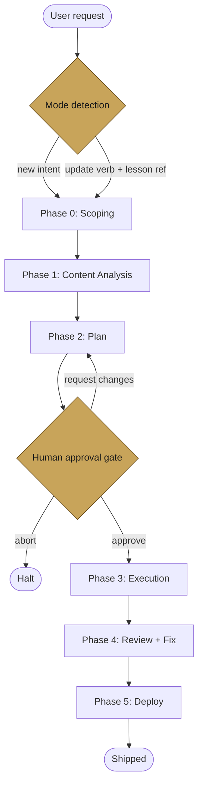

# lesson-builder

A Claude Code skill for building and updating interactive JSX lesson apps. Each lesson is a Vite + React project with tabbed topics, LaTeX math, SVG graphs, manim animations, interactive demos, and an embedded AI tutor chatbot.

The skill operates on a workspace laid out as `<workspace_root>/<course>/claude_lessons/<slug>/`, with shared chat and UI infrastructure at `<workspace_root>/_lesson-core/` imported via a `@core` Vite alias.

## Modes

- **new** — build a lesson from scratch given source materials and scope.
- **update** — modify an existing lesson in place (refine media, add topics, splice content, backfill drift).

Mode is detected from the user's initial request (update verbs like *rework*, *revise*, *fix* + a resolvable lesson reference trigger update mode) and confirmed at the Phase 0 gate.

## Pipeline

Both modes run through the same 6-phase shell. Phase 2 is the only human approval gate; everything downstream is constrained by the approved plan.



### What each phase does

| Phase | New mode | Update mode |
|---|---|---|
| 0 — Scoping | AskUserQuestion interview: course, slug, audience, depth, materials. | Confirm detected lesson, working-tree check, research-depth, scope-of-change, media hints. |
| 1 — Content Analysis | `content-orchestrator-agent` runs per-resource deep-review teams + topic-area research + gap-fill. | Pre-scan existing media inventory (Grep/Glob), diff against user concerns, classify drift / gaps / redundancies. |
| 2 — Plan | Compile a Lesson Plan with ranked media per topic. | Emit a 5-way change-list: `keep / refine / replace / remove / add`, plus structural drift repairs (GRAPH_SCHEMA backfill, chatbot props reconcile, orphan assets). |
| 3 — Execution | Parallel specialists write to `.build-scratch/`; main Claude assembles `src/<slug>.jsx` from the skeleton. | Create `lesson-update/<slug>-YYYYMMDD` branch + optional stash, splice specialist outputs into the existing JSX using pattern anchors, run post-splice sanity pass. |
| 4 — Review + Fix | Parallel code / content / test / visual-QA reviewers. Progress-aware fix loop with hard stop rules. | Same mechanism. Two extra rules: **no-grandfathering** (every final medium runs through visual-QA, including `keep`) and **regression-watch** (halt a fix thread if a refine regresses a previously-clean `keep` medium). |
| 5 — Deploy | `build-all.sh` + headless Playwright smoke check, commit to `main`, push. | Same build gate, commit to update branch, `git merge --no-ff` to `main`, push, stash recovery prompt. Branch and stash are preserved on any failure. |

## Quality policy

**The default is maximum teaching quality.** When a richer medium (manim animation, interactive demo, detailed matplotlib figure) teaches a concept better than a cheaper one, the skill picks the richer medium. Research depth defaults to `full` or `targeted`; the fix loop iterates until the lesson meets the quality bar. Runtime is not the optimization target; student understanding is.

If you want a faster, cheaper pass, say so in the initial prompt. Trigger phrases: *"quick pass"*, *"fast update"*, *"keep it cheap"*, *"avoid manim"*, *"skip research"*, *"minor tweak"*, etc. The skill detects the signal and flips to `resource_mode: "limited"`: prose and static SVG over manim/interactive, research depth capped at `light` or `targeted`, fix loop stops earlier. The detected mode is surfaced during Phase 0 confirmation so you can override it explicitly.

## Key invariants

- **Quality-first default**: `resource_mode: "full"` unless the user explicitly signalled otherwise. See the Quality policy section above.
- **One human gate**, at Phase 2. No exceptions.
- **Specialists in parallel**: graphics, manim, interactive-demo, web-image, and content agents fire concurrently wherever possible.
- **Self-contained agents**: all 15 agents are bundled at `agents/` inside the skill. No workspace or machine-global agent directory required.
- **Shared core at `_lesson-core/`**: lessons import chat, UI primitives, proxy via `@core`. Never inline chat code; bugs fixed in `_lesson-core/` propagate to every lesson.
- **Per-lesson log** at `<lesson_root>/lesson_build.log.md`. Main Claude owns it; update runs append a `## Update YYYY-MM-DD (run-id: <hash>)` section rather than overwriting history.
- **17-test QA suite** runs in Phase 4 (Babel parse, KaTeX safety, topic-context invariants, template compliance, no inlined chat, no emojis, no direct API calls).
- **`GRAPH_SCHEMA` is mandatory**: pairs with `DEFAULT_GRAPH_PARAMS` to type-check chatbot `<<EDIT_GRAPH>>` edits. Missing schemas get backfilled in Phase 3.

## Directory layout

```
SKILL.md                       Entry point — quality policy, mode detection, phase shell, agent team
agents/                        Bundled agent definitions (15 agents, self-contained)
  content-orchestrator-agent.md
  content-review-agent.md
  research-agent.md
  medium-decider-agent.md
  graphics-agent.md
  manim-agent.md
  interactive-demo-agent.md
  web-image-agent.md
  code-review-agent.md
  geometry-agent.md
  colour-agent.md
  readability-agent.md
  scientific-accuracy-agent.md
  motion-timing-agent.md
  interaction-agent.md
references/
  update-mode.md               Update-mode orientation (read first if mode=update)
  phase-0-scoping.md           Scoping interview + scoping artifact format + resource-mode detection
  phase-1-content.md           Content orchestration + existing-media inventory pre-scan
  phase-2-plan.md              Plan compilation + 5-way media taxonomy + approval gate
  phase-3-execution.md         New-mode assembly + update-mode splice algorithm
  phase-4-review.md            Parallel reviews + progress-aware fix loop
  phase-5-deploy.md            Build verify + commit/merge/push + rollback
  template.md                  Lesson JSX skeleton (new-mode starting point)
  server-template.md           package.json, vite.config.js, proxy shim, test_lesson.cjs
  checklists.md                KaTeX safety, template compliance, splice + post-splice checks
  graph-schema-guide.md        GRAPH_SCHEMA derivation + update-mode backfill
  log-template.md              lesson_build.log.md format (new + update append)
```

## Installation

Clone into your Claude Code skills directory:

```bash
git clone https://github.com/ihsan-sa/lesson-builder.git ~/.claude/skills/lesson-builder
```

Claude Code auto-discovers skills in that directory. Trigger by asking Claude to create, build, update, revise, or improve a lesson in a workspace that follows the `<workspace_root>/<course>/claude_lessons/<slug>/` layout.

The skill assumes a sibling `_lesson-core/` module at the workspace root providing the shared chat, UI primitives, and proxy. Without it the `@core` alias cannot resolve and lessons will not load.
