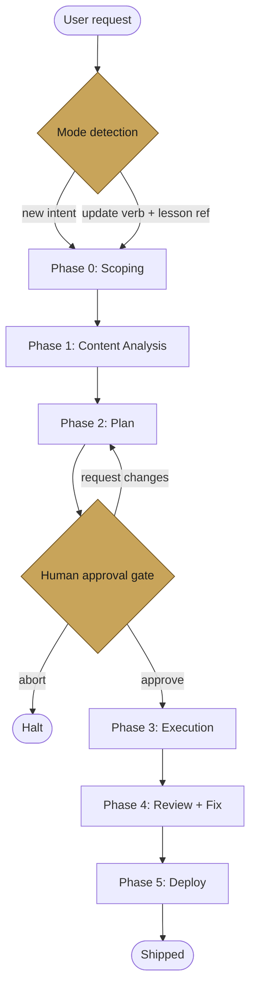

# lesson-builder

A Claude Code skill for building and updating interactive JSX lesson apps. Each lesson is a Vite + React project with tabbed topics, LaTeX math, SVG graphs, manim animations, interactive demos, and an embedded AI tutor chatbot.

The skill operates on workspaces laid out as `<workspace_root>/<course>/claude_lessons/<slug>/`, with shared chat and UI infrastructure at `<workspace_root>/_lesson-core/` imported via the `@core` Vite alias.

## Modes

- **new** — build from scratch given source materials and scope.
- **update** — modify an existing lesson in place (refine media, add topics, splice content, backfill drift).
- **consolidate** — update mode planned at course level: a single plan that moves, merges, or splits topics **across** lessons, approved once, then executed lesson by lesson through the update pipeline.

Mode is detected from the initial request (update verbs like *rework*, *revise*, *fix* + a resolvable lesson reference trigger update mode; restructure verbs like *re-split*, *consolidate*, *merge lessons* trigger consolidate) and confirmed at the Phase 0 gate.

## Pipeline

Both modes share the 6-phase shell. Phase 2 is the only human approval gate; downstream work is constrained by the approved plan. *How* that gate is delivered depends on the session: a dialog with a user at a terminal, a message in a chat-driven session, or a `PLAN FOR APPROVAL` block written to the run's journal plus a `BLOCKED` stop in a headless one (see *Running without a terminal*).


```mermaid
flowchart TD
    Start([User request]) --> MD{Mode detection}
    MD -->|new intent| P0[Phase 0: Scoping]
    MD -->|update verb + lesson ref| P0

    P0 --> P1[Phase 1: Content Analysis]
    P1 --> P2[Phase 2: Plan]
    P2 --> Gate{Human approval gate}
    Gate -->|request changes| P2
    Gate -->|abort| Halt([Halt])
    Gate -->|approve| P3[Phase 3: Execution]
    P3 --> P4[Phase 4: Review + Fix]
    P4 --> P5[Phase 5: Deploy]
    P5 --> Done([Shipped])

    classDef gate fill:#c8a45a,stroke:#6b4e1a,color:#1a1a1a
    class Gate,MD gate
```

### What each phase does

| Phase | New mode | Update mode |
|---|---|---|
| 0 — Scoping | Interview: course, slug, audience, depth, materials, **materials scope** (course-only / fill-gaps / extensions), **deploy destination** (GitHub / custom service / commit-only / skip). Reads `<course>/COURSE.md` first when one exists, so stated course conventions replace questions. | Confirm detected lesson, working-tree check, research-depth, scope-of-change, media hints, deploy destination (defaults to last recorded). Consolidate scopes this to the whole affected lesson set. |
| 1 — Content Analysis | Main Claude fans out extraction/research workers (they persist evidence to `.build-scratch/evidence/`, capped by `materials_scope`); `content-orchestrator-agent` synthesizes the package from the evidence files. | Pre-scan existing media inventory (Grep/Glob), worker spawns per research depth, orchestrator diffs against concerns and classifies drift / gaps / redundancies. |
| 2 — Plan | One whole-lesson `medium-decider-agent` spawn ranks media per topic with a cross-topic diversity check; web images get a license pre-flight; plan surfaces a `DEPLOY:` block (action / service / materials-in-commit). | Emit a 5-way change-list: `keep / refine / replace / remove / add`, plus structural drift repairs and the `DEPLOY:` block. Consolidate emits one course plan of per-lesson change-lists under a single approval. |
| 3 — Execution | Parallel specialists write to `.build-scratch/`; main Claude assembles `src/<slug>.jsx` from the skeleton. Writes private-by-default `.gitignore` covering `materials/`, `source/`, `notes/`, `*.local`, `.env*`. | Create `lesson-update/<slug>-YYYYMMDD` branch + optional stash, splice specialist outputs into the existing JSX using pattern anchors, run post-splice sanity pass. Ensures the lesson `.gitignore` covers any newly attached private paths. |
| 4 — Review + Fix | Parallel code / content / test reviewers plus two independent lenses per artifact (`visual-qa-agent` rubric + `scientific-accuracy-agent`). Progress-aware fix loop, deterministic failures first, hard stop rules. | Same mechanism. Two extra rules: **no-grandfathering** (every final medium runs through visual-QA, including `keep`) and **regression-watch** (halt a fix thread if a refine regresses a previously-clean `keep` medium). |
| 5 — Deploy | Branches on `deploy_action`. `build-all.sh` + headless Playwright smoke check always runs (sanity check). Ask **override the gitignore for this commit?** (default: no — private paths stay out). Commit, then push-to-github / push-to-custom / commit-only per plan. | Same build gate, commit to update branch, `git merge --no-ff` to `main` (skipped under `commit-only`), push per `deploy_action`, stash recovery prompt. Branch and stash are preserved on any failure. |

## Quality policy

**The default is maximum teaching quality.** When a richer medium (manim, interactive demo, detailed matplotlib figure) teaches better than a cheaper one, the skill picks the richer medium. Research depth defaults to `full` or `targeted`; the fix loop iterates until the lesson meets the quality bar. Student understanding is the optimization target, not runtime.

For a faster, cheaper pass, say so in the initial prompt. Trigger phrases: *"quick pass"*, *"fast update"*, *"keep it cheap"*, *"avoid manim"*, *"skip research"*, *"minor tweak"*. The skill flips to `resource_mode: "limited"`: prose and static SVG over manim/interactive, research capped at `light` or `targeted`, fix loop stops earlier. The detected mode is surfaced at Phase 0 for explicit override.

Teaching quality is evidence-based: lessons are planned backward from measurable objectives, each topic gets a **teaching arc** (central question, entry state, purposed moves, example functions, exit model and exit evidence — planned before any prose exists, and rejected if its moves can be reordered without changing meaning), prose follows the discourse rules in `references/teaching-communication.md` (shortest explanation with no necessary inference unstated, one controlling claim per paragraph, representation matched to structure, analogies off by default, no seductive detail), the embedded tutor follows a withhold-first pedagogy policy plus the teaching spec's communication block with seven response modes and budgets (both injected from the shared `_lesson-core` so every lesson runs the same current rules), a Phase 4 pedagogy gate checks every objective is assessed and every arc survived, the content reviewer runs an exhaustive accuracy pass and a calibrated discourse pass scored on a 0–3 rubric (and is calibrated against twenty-four blind seeded fixtures in `evals/teaching/`), and a debunked-myths guardrail (learning styles, Dale's cone percentages, gamification badges, etc.) blocks intuitive-but-wrong patterns from shipping.

## Incremental courses

A course whose material arrives in chunks over a term — an outline up front, then notes, slides, and photos every few days — gets a course layer above the lesson pipeline. Opt in by putting a `COURSE.md` at `<workspace_root>/<course>/`:

- **Course context.** Phase 0 reads its lesson map (slug ↔ outline units ↔ status), `## Conventions` (notation, audience, depth — stated conventions beat ones inferred from a sibling lesson), `## Pending chunks`, and `## Materials index`. `<workspace_root>/<course>/materials/` is then a recognised **committed** inbox for arriving material, distinct from the private, gitignored `<lesson_root>/materials/`; `provided_materials` entries reference inbox files in place.
- **Chunk triage.** Each arriving chunk resolves to *refine an existing topic*, *add a topic*, *build a new lesson*, or *restructure*, with explicit triggers (a lesson past 6–7 topics, moved outline-unit boundaries, a topic spanning two lessons, a lesson thinned below 2 topics).
- **Batching.** Small chunks accumulate as pending until they change a topic's substance or the user asks for a build — because a run's cost is nearly fixed (Phase 4 re-QAs every kept medium under no-grandfathering), so ten small runs cost about ten times one batched run.
- **`consolidate`.** One course-level plan for cross-lesson restructures, one approval, executed lesson by lesson.

Details: `references/course-curation.md`. Nothing here is required — a workspace with no `COURSE.md` behaves exactly as before.

## Running without a terminal

The skill's gates assume a user at a terminal, which is one of three session modes. `session_mode` is detected once at Phase 0 — from what the harness or user states, a worker environment variable, the absence of a TTY, or the presence of a chat transport — and recorded in the scoping artifact:

| `session_mode` | Every user gate is delivered as |
|---|---|
| `interactive` | an `AskUserQuestion` dialog |
| `channel` | one message carrying the same body, answered with `go` / `approve`, `changes: …`, or `abort`; silence is never approval |
| `headless` | the full plan written to the run's journal under `## PLAN FOR APPROVAL <hash>`, then a stop with `BLOCKED: plan awaiting approval`; the run resumes when a later dispatch carries a matching `APPROVED PLAN <hash>` |

`AskUserQuestion` must not fire in the last two — the dialog would render where nobody is looking. Gates with a documented safe default (gitignore override → no override, dirty tree → abort, orphans → keep, stash → leave in place) take it and report rather than blocking; only decisions that cannot be defaulted block. Details: `SKILL.md` § Session modes and gates.

## Key invariants

- **Quality-first default**: `resource_mode: "full"` and `effort_mode: "standard"` unless the user signalled otherwise.
- **One human gate**, at Phase 2. No exceptions — and never an `AskUserQuestion` dialog in a session that has no terminal; the gate takes the channel or journal form instead.
- **Specialists in parallel**: graphics, manim, interactive-demo, web-image, and content agents fire concurrently. Media decisions go through one whole-lesson decider spawn.
- **Self-contained agents**: all 12 agents bundled at `agents/`. No workspace or machine-global dir required. Agent `model:` frontmatter is a floor — main Claude picks the tier per spawn from the `effort_mode` policy in `SKILL.md` (default: Opus 5 for judgment, Sonnet 5 for production, Haiku for mechanical; Fable 5 only on an explicit deep-work signal).
- **Shared core at `_lesson-core/`**: lessons import chat, UI primitives, proxy via `@core`. Never inline chat code.
- **Per-lesson log** at `<lesson_root>/lesson_build.log.md`. Main Claude owns it; updates append rather than overwrite.
- **17-test QA suite** runs in Phase 4 (Babel parse, KaTeX safety, TOPIC_CONTEXT invariants, template compliance, no inlined chat, no emojis, no direct API calls).
- **`GRAPH_SCHEMA` is mandatory**: pairs with `DEFAULT_GRAPH_PARAMS` to type-check chatbot `<<EDIT_GRAPH>>` edits. Missing schemas are backfilled in Phase 3.

## Directory layout

```
SKILL.md                       Entry point — quality policy, mode detection, phase shell, agent team
agents/                        Bundled agent definitions (12 agents, self-contained)
  content-orchestrator-agent.md
  content-review-agent.md
  research-agent.md
  medium-decider-agent.md
  graphics-agent.md
  manim-agent.md
  interactive-demo-agent.md
  web-image-agent.md
  code-review-agent.md
  visual-qa-agent.md
  scientific-accuracy-agent.md
  interaction-agent.md
references/
  bootstrap.md                 Workspace bootstrap procedure (fresh-workspace gate)
  bootstrap/                   Canonical payload shipped with the skill:
    _lesson-core/                Drop-in copy of the shared module imported via @core
    lesson-template/             Skeleton lesson project (package.json, vite.config.js
                                 with workspace-root envDir, proxy shim, main.jsx,
                                 index.html, test_lesson.cjs, CLAUDE.md, .gitignore)
    workspace-root/              Workspace-level templates (gitignore.template,
                                 env.local.example, build-all.sh, netlify.toml,
                                 .claude/agents/ runtime tutor team)
  update-mode.md               Update-mode orientation (read first if mode=update); includes
                               consolidate and what a small update costs
  course-curation.md           Course layer: COURSE.md context, committed course materials
                               inbox, chunk triage, batching, consolidate plan format
  phase-0-scoping.md           Scoping interview + scoping artifact format + resource-mode detection
  phase-1-content.md           Content orchestration + existing-media inventory pre-scan
  phase-2-plan.md              Plan compilation + 5-way media taxonomy + approval gate
  phase-3-execution.md         New-mode assembly + update-mode splice algorithm
  phase-4-review.md            Parallel reviews + progress-aware fix loop
  phase-5-deploy.md            Build verify + commit/merge/push + rollback
  template.md                  Lesson JSX skeleton (new-mode starting point) + exposition exemplars
  teaching-communication.md    Discourse layer: representation/exposition rules, analogy policy,
                               teaching arc, tutor response modes (canonical; mirrored in the tutor prompt)
evals/teaching/                Calibration + benchmark assets: lesson-fragments/ (12 blind reviewer
                               fixtures), tutor-cases.jsonl (12 tutor fixtures, 6 probes, 100 stratified
                               cases), rubric.md, expected-failures.json (answer key), README.md (how to run)
  server-template.md           package.json, vite.config.js, proxy shim, test_lesson.cjs
  checklists.md                KaTeX safety, template compliance, splice + post-splice checks
  desmos-schema.md             Desmos state schema + string-vs-number footguns
  graph-schema-guide.md        GRAPH_SCHEMA derivation + update-mode backfill
  log-template.md              lesson_build.log.md format (new + update append)
```

## Installation

Clone into your Claude Code skills directory:

```bash
git clone https://github.com/ihsan-sa/lesson-builder.git ~/.claude/skills/lesson-builder
```

Claude Code auto-discovers skills there. Trigger by asking Claude to create, build, update, revise, or improve a lesson in a workspace using the `<workspace_root>/<course>/claude_lessons/<slug>/` layout.

A sibling `_lesson-core/` module is required at the workspace root. If it does not already exist, the skill installs it from `references/bootstrap/_lesson-core/` before Phase 0 (see `references/bootstrap.md`). `VITE_DESMOS_KEY` in a workspace-root `.env.local` is required for any lesson that embeds `<DesmosGraph/>` or the chatbot `<<DESMOS>>` protocol; obtain a free educational key at https://www.desmos.com/api. Each lesson's `vite.config.js` points `envDir` at the workspace root, so that single `.env.local` serves every lesson.

The embedded chatbot requires the `claude` CLI on `PATH` (the Express proxy spawns it per chat session; no API key is stored in the workspace). The chat panel renders in dev only — static production builds ship without it.
